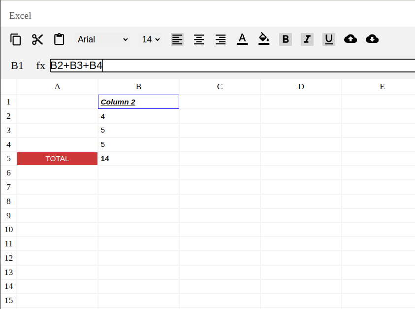

# Google Sheets Clone 📊

## Overview
A comprehensive web application mimicking Google Sheets, built using React.js, offering robust spreadsheet functionality with advanced features.

[Experience the Application](https://google-sheet-assignment-zeotap.vercel.app/)

## 🚀 Tech Stack & Architecture

### Technologies
- **Frontend**: React.js
- **State Management**: React Hooks
- **Styling**: CSS

### Key Architectural Decisions
- **Performance Optimization**: 
  - Implemented React.memo for efficient re-rendering
  - Optimized state management to minimize unnecessary updates
- **Formula Evaluation**:
  - Infix to postfix conversion algorithm
  - Depth-First Search (DFS) for cycle detection in formulas

## ✨ Features

### 1. Cell Editing & Styling
- Edit cell contents dynamically
- Advanced styling options:
  - Text formatting (Bold, Italic, Underline)
  - Text alignment
  - Font customization (Family, Size)
  - Color and background color selection

### 2. Spreadsheet Management
- Create and edit multiple sheets
- Convert sheets to JSON
- Load sheets from JSON

### 3. Formula Handling
- Dynamic formula evaluation
- Automatic dependent cell updates
- Supports complex cell referencing
- **Limitation**: Does not support unary operators directly

### 4. Clipboard Functionality
- Single cell copy and paste
- Preserves formulas and styling

## 📦 Data Structures
- **Cell**: Object representing individual spreadsheet cell
  - Properties: value, formula, style, dependencies
- **Sheet**: Collection of cells with grid-like structure
- **Workbook**: Container for multiple sheets

## 🛠 Development Approaches
- **CSS Techniques**:
  - Extensive use of Flexbox
  - Creative visibility management (opacity tricks)
- **Performance Optimization**:
  - Minimized unnecessary re-renders
  - Intelligent state storage
- **Formula Parsing**:
  - Implemented custom parsing algorithm
  - DFS-based recursive dependency detection

